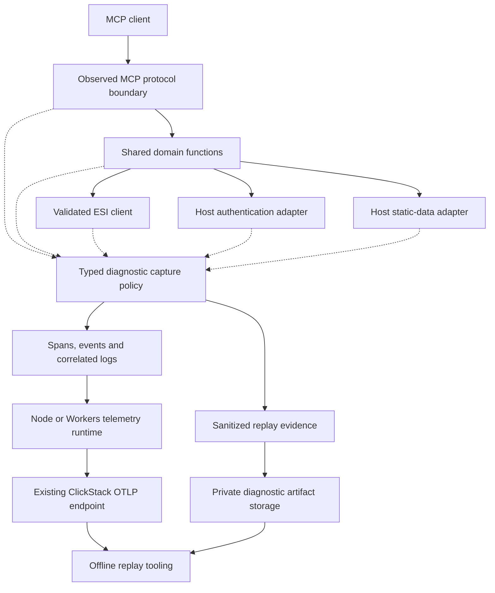

# MCP OpenTelemetry architecture proposal

Status: **Accepted for implementation and deployment by the user on 9 September 2026.**

Investigated 9 September 2026. Covers the shared library, hosted Workers and local
stdio server. Retain OpenTelemetry and the existing ClickStack destination, replace
the sparse instrumentation with explicit diagnostic contracts, and make offline
reproduction an acceptance requirement.

A useful trace answers: **what was requested, which functions ran, what safe values
they consumed, what decisions they made, what dependencies returned, and why the
observable result followed**. Timing and a failure flag are insufficient.

The main decisions proposed for review are:

- Active nested spans at protocol, domain-function and dependency boundaries.
- Mandatory safe input, decision, output and error contracts for those functions.
- Sanitized dependency evidence for offline replay, with explicit completeness.
- Shared API instrumentation with separate Node and Workers runtime adapters.
- Acceptance based on exported traces and successful reproduction of failures.

## 1. Findings in the current implementation

These are source findings, not claims about traces retrieved from production.

| Repository inspected    | Revision                                   | Relevant state                                                                                              |
| ----------------------- | ------------------------------------------ | ----------------------------------------------------------------------------------------------------------- |
| `eve-online-mcp`        | `c7763392829fce717fa3f28b62cf63ce387d6858` | Local consumer pins library `1d8f29b`; it has no telemetry bootstrap or shared instrumentation.             |
| `eve-online-mcp-lib`    | `84e5d12aa5781339968338d939e47daee338a93b` | Contains the shared OpenTelemetry wrappers.                                                                 |
| `eve-online-hosted-mcp` | `2bb5b587539b97da7165d2548b6ca89557ca8312` | Pins library `84e5d12`; exports directly to ClickStack. Existing unrelated working changes were left alone. |

| Evidence                                                                                                                  | Consequence                                                                                                                                                                                                                          |
| ------------------------------------------------------------------------------------------------------------------------- | ------------------------------------------------------------------------------------------------------------------------------------------------------------------------------------------------------------------------------------ |
| Shared `src/telemetry.ts:38`, and calls in `esi-client.ts`, `skill-plan.ts`, `market-snapshot.ts`, `character-context.ts` | Most spans begin with `{}` and finish with only `eve.operation.failed`. Inputs, intermediate values, branch decisions and result summaries are absent.                                                                               |
| Shared `src/server.ts:123` onwards                                                                                        | Repeated `mcp.tool` names and `mcp.name` omit the protocol method, standard tool attributes, negotiated version and request context. Tool callbacks also miss validation failures before the callback and other protocol operations. |
| Hosted `src/mcp/worker.ts:228` and `src/telemetry.ts:36`                                                                  | Custom propagation extracts HTTP headers. No application handling of per-message `params._meta` trace context was found.                                                                                                             |
| Shared `src/esi-client.ts:534`                                                                                            | `esi.http` wraps `fetch()` only, uses default INTERNAL kind, and captures neither response status nor body-read failure. A returned HTTP 429 does not throw inside this wrapper; its HTTP span can appear successful.                |
| Shared `src/telemetry.ts:38`; hosted `src/telemetry.ts:73`                                                                | Error information is reduced to booleans. Raw messages and public error objects cannot safely be copied wholesale, but useful typed codes and safe details are discarded too.                                                        |
| Shared `src/character-context.ts:158`, `market-snapshot.ts:207`                                                           | Partial results have explicit domain meaning. A wrapper recognizing only `isError` cannot explain partial collection or its stopping condition.                                                                                      |
| Hosted `src/telemetry.ts:61`                                                                                              | First 512 completed spans win. Parents finish later and can be discarded after their children fill the buffer. There is no dropped-span marker or total byte budget.                                                                 |
| Hosted `src/telemetry.ts:79`                                                                                              | Every HTTP status at least 400 sets ERROR without distinguishing caller rejection, dependency failure and MCP outcome.                                                                                                               |
| Shared `src/telemetry.ts:12`; hosted `src/telemetry.ts`                                                                   | Library meter instruments exist, but the host installs no MeterProvider. Hand-built invocation metrics do not make the library metrics work.                                                                                         |
| Hosted `src/telemetry.ts:52,89`                                                                                           | Version is hard-coded; export starts when the operation returns a `Response`. Completion for streamed work and later child spans is not established.                                                                                 |
| Both repositories' `test/telemetry.test.ts`                                                                               | Tests establish simple parentage, isolation and payload omission, not diagnostic sufficiency, real MCP message propagation, HTTP error classification, overflow behavior or replay.                                                  |

Preserve host-owned exporters, runtime-independent shared instrumentation, async
context isolation, read-only ESI validation and credential separation.

## 2. Standards and interpretation

OpenTelemetry has MCP-specific conventions, currently **Development**. Use names
such as `tools/call get_market_snapshot`, SERVER kind, and `mcp.method.name`,
`gen_ai.tool.name`, `gen_ai.operation.name=execute_tool`. Record negotiated
`mcp.protocol.version` and safe `jsonrpc.request.id`. Prompts use
`gen_ai.prompt.name`; resources use a reviewed URI. Receiver duration uses
`mcp.server.operation.duration`, in seconds. Pin the reviewed conventions revision
during implementation; do not silently track a moving document.
[OTel MCP conventions](https://github.com/open-telemetry/semantic-conventions-genai/blob/main/docs/gen-ai/mcp.md)

MCP documents unprefixed W3C `traceparent`, `tracestate` and `baggage` keys in
`params._meta` for transport-independent propagation. SEP-414 is Final but is a
historical record: also check behavior against each negotiated protocol version
supported by the installed SDK. [MCP SEP-414](https://modelcontextprotocol.io/seps/414-request-meta)

Use active spans so nested synchronous and asynchronous calls inherit context.
The library depends on the API; hosts supply context management, SDK and export
lifecycle. [OTel JavaScript instrumentation](https://opentelemetry.io/docs/languages/js/instrumentation/)

Meaningful input/output and contextual metadata are central to Langfuse's
trace-quality guidance. Apply that principle without adding a Langfuse dependency.
This server performs ESI/domain work; it has no LLM generations whose model or
token usage it should invent.
[Langfuse trace best practices](https://langfuse.com/docs/observability/best-practices)

The capture contracts and policies below are proposed project decisions, not
claims that OpenTelemetry automatically captures these values.

## 3. Architecture and ownership



| Owner                  | Responsibility                                                                                                                                                                          |
| ---------------------- | --------------------------------------------------------------------------------------------------------------------------------------------------------------------------------------- |
| Library `telemetry.ts` | Sync/async active-span helpers, stable library instrumentation scope/revision, host-injected tracer, meter and diagnostic sinks. No SDK initialization or Node/Cloudflare dependencies. |
| Library `diagnostics/` | Versioned capture schemas, safe projections, typed outcomes/errors, limits and replay manifest types. No generic serializer accepting security-sensitive objects.                       |
| Shared MCP integration | One observation around dispatch, validation, execution and response serialization for each protocol operation. Domain callbacks enrich that context.                                    |
| Local host             | Node SDK bootstrap before server construction, configurable OTLP export, bounded shutdown on EOF/signals, local artifact writer. Never telemetry on MCP stdout.                         |
| Hosted host            | Workers context and invocation lifecycle; transport/service-binding, Auth, Durable Object, D1/R2 and Workflow instrumentation; export scheduling and bounded buffering.                 |
| Replay tooling         | Export a diagnostic bundle and invoke the public MCP interface against recorded dependencies without production credentials or live upstream access.                                    |

Replace the global-meter/request-tracer mismatch with a cohesive request-local
telemetry runtime in Workers. Shared instrumentation obtains its named tracer,
meter and sinks from that runtime; Node supplies process-scoped providers. Global
installation happens once in host bootstrap, never per request. Library spans retain
the library scope instead of acquiring the host service's instrumentation scope.

**Protocol integration needs a compatibility test.** The installed hosted SDK is
`@modelcontextprotocol/server@2.0.0`; inspected source exposes protocol handlers
and transport `onmessage`/`send` boundaries, without built-in OTel handling in the
inspected dispatch code. Use supported interception points or a small owned
transport adapter, not private-method monkey-patching.

A tool-callback wrapper cannot observe SDK validation. Starting a span around
`onmessage` and ending it when that callback returns is also insufficient if the
SDK schedules asynchronous response work. Correlate the request through actual
response send/failure, activate context during dispatch, and dispose request state
on final completion, cancellation or expiry. Close transport observations on a
disconnect, but preserve logical request state when the negotiated protocol allows
resumption. A disconnected SSE connection does not itself cancel its MCP request.
[MCP transport lifecycle](https://modelcontextprotocol.io/specification/2025-11-25/basic/transports)

Notifications need completion hooks
because they have no response. Resolve any SDK limitation here before claiming
complete protocol coverage.

## 4. Span boundaries and propagation

One logical MCP request gets one MCP server span. Cover supported discovery/list
methods, tools, resources, prompts and notifications, including rejection paths.
Do not create a session-long root or treat an HTTP connection as one tool call.
Record the negotiated version; do not assume initialization or sessions exist in
every supported version.

Proposed context policy:

1. Validate and extract each message's `_meta`. An admitted message parent takes
   precedence over ambient HTTP context; link the HTTP span when present. This is
   the MCP convention's parent/link model.
2. Without an admitted message parent, use the HTTP span as a documented fallback;
   stdio starts a local root. Record `eve.trace.parent_source` as `mcp_meta`, `http`,
   `local` or `untrusted_link`.
3. Public caller trace IDs are untrusted correlation hints. By default create an
   independently sampled local trace and link valid external context. Explicitly
   trusted callers may join the distributed trace. Reject malformed context, bound
   carrier sizes and drop inbound baggage initially. This deliberately narrows the
   default MCP parent recommendation at the public trust boundary.
4. External sampled flags cannot disable local diagnostics or bypass quotas. Trace
   metadata grants neither authentication nor access to another user's traces.
5. Inject context from a CLIENT span into owned MCP-to-Auth, Auth-to-refresh and
   MCP-to-SDE calls; extract it in the receiving invocation. Build outbound headers
   from an allowlist.
6. Do not forward baggage or trace headers to ESI, EVE SSO or OIDC providers by
   default. Keep local CLIENT spans for those dependencies.
7. OAuth browser redirects are separate requests. Connect them using a generated
   non-secret flow reference stored with server-side flow state, never the OAuth
   state, code, cookie or token itself.
8. Durable refresh work observes queue wait, cache check, refresh, persistence and
   grant recheck. Explicitly bind the triggering context when queued callbacks run.
   If work is shared, link additional waiting callers.
9. Workflow metadata carries only safe propagation fields. Long-lived workflow
   steps use separate linked traces with run, step and attempt references. Never
   hold an invocation open through durable sleeps. Each executed retry has its own
   span; restored checkpoints are identified as restored, not re-executed work.

OpenTelemetry calls for caution with external context and baggage; these policies
apply that boundary to this service.
[OTel propagation security](https://opentelemetry.io/docs/concepts/context-propagation/#security-best-practices)

Every significant function call gets a span when it owns meaningful computation,
validation, I/O, retries or a diagnosable decision. This includes synchronous graph
building and training replay. Tiny per-item conversions can attach a bounded
diagnostic to their enclosing validation span; a million-row import must not create
a million empty spans. Span names identify fixed functions/operations; indices and
dataset identifiers are attributes.

Target call structure for a protected planning request:

```text
tools/call generate_skill_plan                         SERVER
  mcp.validate_arguments                              INTERNAL
  eve.skill_plan.generate                             INTERNAL
    eve.static_data.initialize                        INTERNAL
      SELECT sde_control                              CLIENT
      SELECT sde_catalog                              CLIENT (bounded batches)
    eve.targets.resolve                               INTERNAL
    eve.esi.authorize                                 INTERNAL
      POST /internal/token                            CLIENT
        POST /internal/token                          SERVER (Auth Worker)
          eve.auth.require_connection                 INTERNAL
          POST /internal/refresh                      CLIENT
            eve.auth.refresh                          SERVER (Durable Object)
              eve.auth.refresh.wait                   INTERNAL
              eve.auth.refresh.cache                  INTERNAL
              POST /v2/oauth/token                    CLIENT (when needed)
              eve.auth.persist_rotation               INTERNAL
          eve.auth.recheck_grant                      INTERNAL
    eve.esi.call                                      INTERNAL (skills)
      eve.esi.validate                                INTERNAL
      eve.cache.lookup                                INTERNAL
      GET /characters/{character_id}/skills            CLIENT
      eve.esi.decode                                  INTERNAL
    eve.esi.call                                      INTERNAL (queue)
      ...
    eve.skill_plan.validate_evidence                   INTERNAL
    eve.skill_plan.replay_training                     INTERNAL
    eve.skill_plan.build_graph                         INTERNAL
    eve.skill_plan.build_rows                          INTERNAL
    eve.skill_plan.verify                              INTERNAL
  mcp.serialize_result                                INTERNAL
```

This is a proposed structure, not a captured trace. Avoid duplicate automatic and
manual spans for the same network operation. If a network span ends at headers,
explicitly trace the remaining body read/decode; prefer a controlled fetch adapter
observing consumption/cancellation, response status and byte counts. Never equate
`fetch()` resolution with a successful ESI operation.

## 5. Observation contracts: inputs, variables and results

Every instrumented function has a reviewed contract for input, derived state,
outcome and failure, including omitted/redacted fields. Empty contracts require an
explanation. Helpers provide context and lifecycle; functions supply variables
while they are available, including values at early exits.

| Layer          | Proposed recorded context                                                                                                                                                                                                  |
| -------------- | -------------------------------------------------------------------------------------------------------------------------------------------------------------------------------------------------------------------------- |
| Resource       | Actual service/version, environment, host Git revision, deployed Worker version or Node runtime version, library revision, lockfile digest. No environment dumps, process arguments or home paths.                         |
| MCP            | Standard method/tool/prompt fields, negotiated version, transport, generated request reference, admitted client name/version, outcome, diagnostic schema/policy version and replay readiness.                              |
| Safe input     | Exact allowlisted values, optional-field presence and defaults; original versus effective input where normalization matters; omitted unknown-field count.                                                                  |
| ESI validation | Pinned OpenAPI digest, verified operation ID, method/template, required scopes, reviewed path/query/body fields; failing field path, rule and safe typed witness.                                                          |
| ESI call       | Character-selection source, public/protected mode, byte limit, cache decision, actual attempts, HTTP status, consumed bytes, parse format, pagination/freshness and retry advice.                                          |
| Cache          | Hit/miss/expired/bypass, reason, logical entry reference, fetch/serve/expiry times, safe credential-partition reference. Never the current cache key: it contains a URL and token digest.                                  |
| Authentication | Verification outcome, character match boolean, reviewed required/missing scopes, selection source, cache hit, relative expiry, grant/credential version, refresh/rotation persistence outcome. No token or decoded claims. |
| Static data    | Build number, catalog digest, parser/schema version, checked time/stale reason, selected generation, refresh requested/in progress and safe counts.                                                                        |
| Result         | Typed summary: status, counts, branch, stopping reason, reached limits, warnings by stable code, digest over the safe output projection.                                                                                   |
| Error          | Domain code, failing stage, retryability, safe details, cause reference and sanitized source frames. Never raw `error.details`.                                                                                            |

Contracts grounded in existing functions:

| Function/tool family         | Variables needed for diagnosis and replay                                                                                                                                                                                                                                                                 |
| ---------------------------- | --------------------------------------------------------------------------------------------------------------------------------------------------------------------------------------------------------------------------------------------------------------------------------------------------------- |
| `getMarketSnapshot`          | `regionId`, `typeId`, reviewed `locationId`, `maxPages`, `maxAggregateBytes`; page, `pageBytes`, `aggregateBytes`, `observedPageCount`, returned page count, duplicates/conflicts, `inconsistent`, `stopReason`; filtered counts and aggregates. Preserve safe dependency page evidence, not only totals. |
| `getCharacterContext`        | Character reference, selected sections, byte limit, section order, authorization outcome, per-section success/error/omission, serialized candidate size and final status. Private section bodies remain excluded.                                                                                         |
| `SkillPlanner.generate`      | Safe target form, resolved public IDs/levels, resolution status, effective `queuePolicy`, catalog identity, validation rule, graph counts, ordering decisions and verification outcome. Private skill/queue evidence follows the privacy policy.                                                          |
| Graph/training replay        | Public requirements/catalog references, baseline provenance, permitted public cycle/prerequisite IDs, ordering/tie-break rule and target-satisfaction result. Private baseline values require omission or synthetic evidence.                                                                             |
| Entity/target resolution     | Input variant, normalization rule/locale, duplicate positions/counts, candidate categories/counts and match status. Exact public SDE tokens can be retained; arbitrary names/free text are omitted by default. Use reviewed witnesses for normalization bugs.                                             |
| ESI/search/catalog tools     | Valid operation/filter values, enum/default application, bounded match count and per-operation field policy. Public/scoped access is not a telemetry sensitivity classification.                                                                                                                          |
| Character management/prompts | Action/template/version, outcome, safe variable projection and counts. No character lists, sensitive authorization links, account claims or free-form prompt text.                                                                                                                                        |
| SDE import                   | Public build/checksum/dataset, stage/shard, bytes/rows, attempt, checkpoint, lease decision, duplicate/CRC/parse rule and publish/fallback decision. Dataset/shard identifiers never enter span names.                                                                                                    |

Attribute keys come from the diagnostic schema, not input keys. Use scalar or
homogeneous-array attributes supported by the selected JS API. Small projections
can be valid bounded JSON under `eve.input.json`/`eve.output.json`; do not truncate
into invalid JSON. Prefer scalar fields for filtering. Larger evidence belongs in
correlated structured logs/artifacts, without copying entire results to ancestors.

Use standard opt-in argument/result fields only when their semantics remain
accurate after capture. A count-only summary is `eve.output.*`, not falsely
presented as the full tool result.

## 6. Privacy with useful diagnostic evidence

The hosted `AGENTS.md` currently prohibits logging tool arguments and ESI bodies.
This proposal explicitly replaces blanket omission with **reviewed safe field
projections**, as requested. Update that instruction and the hosted architecture
together after approval. This does not authorize raw payload logging or capture
of private game data.

| Data class                                     | Proposed default policy                                                                                                                                                                                                                        |
| ---------------------------------------------- | ---------------------------------------------------------------------------------------------------------------------------------------------------------------------------------------------------------------------------------------------- |
| Static public identifiers and controls         | Exact validated type/region IDs, public SDE names, enum options, levels, booleans, limits and schema/build versions. Classify `locationId`: public stations and private structures differ.                                                     |
| Free text, malformed fields, arbitrary names   | Type/length/shape and validation rule by default. Numeric/enum witnesses require a field policy. Schema-valid strings are not automatically safe.                                                                                              |
| Player/user/client/session/connection identity | Omit unless correlation is needed. Use per-trace aliases or host-generated keyed, environment-separated pseudonyms with rotation. These remain sensitive operational metadata. Never plain hashes of enumerable IDs, names or email addresses. |
| Private character/corporation state            | Exclude wallets, assets, location, mail, private structures, exact skill progress and queue contents. Capture safe decisions and replay gaps; synthetic witnesses may reproduce a rule without exporting its private source.                   |
| Credentials                                    | Never capture tokens, client secrets, codes, cookies, PKCE material, OAuth state, encryption material, credential/token hashes or OTLP authorization. Applies to attributes, events, logs, links, baggage and artifacts.                       |
| Public ESI responses                           | Per-operation projection only. Drop unreviewed fields and player-created free text. Preserve approved types, values and ordering needed by the computation. Public access alone does not make a whole response safe.                           |

Apply policy **before values enter the SDK**, including exceptions, automatic
HTTP/database instrumentation and artifact storage. Exporter filtering is defense
in depth. Do not stringify entire objects and then apply regex redaction. Malformed
data may contain secrets even where the expected type is numeric.

Raw URLs, callback queries, auth headers, arbitrary response headers and SQL bound
values stay out. Record matched routes/templates, fixed query identifiers and
reviewed header values. Caller-provided session and JSON-RPC IDs can contain private
text; admit them only under policy, otherwise generate a custom reference and
record the omission. Never attach character identity to public-only operations
merely because the host has authenticated the MCP caller.

Proposed retention: 14 days for diagnostic traces and artifacts, 30 days for
operational aggregates, separated by environment. Artifacts use private storage
and operator authentication, without bearer download links in telemetry. No extra
credential-database binding is granted to the MCP Worker. These are reviewable
defaults, not statements about current ClickStack configuration.

## 7. Errors, partial results and logs

Create typed domain error descriptors where the failure is understood. Example:
`INVALID_UPSTREAM_RESPONSE`, stage `market.parse_page`, field `price`, rule
`finite_nonnegative_number`, observed type `string`. Omit an unsafe rejected value;
provide a synthetic witness and explicit omission when useful.

The current MCP convention treats receiver-side invalid-request codes (`-32700`,
`-32600`, `-32601`, `-32602`, `-32002`) differently from server failures. Record
their RPC code and rejection outcome without automatically setting server ERROR.
Tool results with `isError=true` use `error.type=tool_error` plus a separate domain
code. Pin this classification with the convention revision.
[MCP server error semantics](https://github.com/open-telemetry/semantic-conventions-genai/blob/main/docs/gen-ai/mcp.md#server)

| Outcome                                     | Recording policy                                                                                                                      |
| ------------------------------------------- | ------------------------------------------------------------------------------------------------------------------------------------- |
| Successful complete result                  | UNSET status; `eve.outcome=complete`; result summary.                                                                                 |
| Valid ambiguity / target selection needed   | UNSET; `eve.outcome=needs_input`; candidate count and decision.                                                                       |
| Supported partial result                    | Outer span UNSET; `eve.outcome=partial`; reason and failed/omitted counts. Failed child operations retain errors.                     |
| Thrown failure / tool error                 | ERROR on the failed operation, stable `error.type`, domain code and safe details.                                                     |
| Caller rejection / expected login challenge | Separate rejected/auth outcome. Apply receiver semantics; do not count every challenge as an infrastructure failure.                  |
| Successful retry                            | Failed attempt spans remain; enclosing operation UNSET with actual attempt count. Instrumentation itself adds no application retries. |
| Cancellation / deadline                     | Distinguish caller cancellation, disconnect and server/dependency timeout. End observations and mark incomplete result/evidence.      |

HTTP server 4xx and HTTP client 4xx have different default error semantics; HTTP
200 can carry an MCP tool failure. Keep HTTP status, RPC code and domain outcome
separate. [OTel HTTP status conventions](https://opentelemetry.io/docs/specs/semconv/http/http-spans/#status)

Record an unhandled exception once as a correlated structured log with trace/span
IDs, safe type, fixed message template and sanitized source frames. Remove the raw
stack's first line, home paths, URLs and embedded values; retain repository-relative
file/function/line/column and build/source-map identity. Ancestors reference the
failure without repeating the exception. Current OTel guidance recommends exception
logs and avoiding duplicate recording.
[OTel recording errors](https://opentelemetry.io/docs/specs/semconv/general/recording-errors/)

Classify outcomes before translating exceptions into MCP/HTTP responses. Returning
JSON from a catch does not make the operation successful. Expected decisions are
bounded events; errors and replay evidence are correlated logs/artifacts. MCP's
protocol logging facility is not the OTLP diagnostic channel.

## 8. Reproduction is a defined output

An input and a digest cannot replay a mutable dependency. Today's ESI and active
SDE cannot recreate yesterday's observations. Capture safe dependency evidence
during the original execution and retain immutable evidence too large for a trace.

| `eve.replay.status` | Meaning                                                                                                                                                            |
| ------------------- | ------------------------------------------------------------------------------------------------------------------------------------------------------------------ |
| `exact`             | All safe inputs, dependency observations, relevant initial state, versions and nondeterministic inputs needed at the declared boundary are captured and available. |
| `synthetic`         | Transformed evidence preserves a declared failure condition, not the exact private production execution.                                                           |
| `partial`           | Diagnosis is supported, but listed missing/redacted/truncated data prevents the declared replay.                                                                   |
| `unavailable`       | Capture is disabled, lost, unsupported or failed; record a reason when a completion signal survives.                                                               |

Also record `eve.replay.boundary`: `mcp`, `domain`, `auth-adapter` or `sde-step`, and
which safe observable properties replay compares. A synthetic domain fixture must
not be described as an exact MCP reproduction.

Each versioned bundle contains:

- Host/library revisions, lockfile digest, runtime compatibility, diagnostic schema,
  OpenAPI digest, SDE/catalog identity and immutable artifact digests.
- Safe original MCP input and effective defaults, optional-field presence, and a
  generated request ID where the original cannot be retained.
- Ordered dependency observations matched by logical call reference, attempt and
  page/section: reviewed request, status, selected headers, safe response or
  synthetic fixture, consumed byte count and parse/transport failure.
- Initial cache entries/expiry and partition aliases, selection source, fake auth
  adapter outcomes, grants and version transitions. No real tokens. Cryptography
  tests use separately generated local keys and locally issued fixtures as needed.
- Clock readings affecting expiry, queue comparisons or retries, relevant random
  outcomes, and concurrency ordering/barriers. Timestamps alone cannot reproduce
  arbitrary timing races.
- Expected MCP result/error or declared safe projection, comparison rules, final
  outcome, completeness, omissions, truncation and capture failures.

Small evidence can live in correlated structured OTLP logs. Larger evidence uses a
dedicated private diagnostic R2 bucket in hosted mode and a restricted directory
locally, separate from SDE staging and credentials. Stream safe projected evidence
into bounded staging as dependencies run; never buffer unsanitized bodies waiting
to discover whether a request fails. Retain evidence for admitted diagnostic traces
on successes too: incorrect successful results also need debugging.

The root records an opaque artifact reference. A correlated
`eve.diagnostics.capture_complete` or `capture_failed` log records upload outcome
and finalized manifest digest. Replay readiness requires a verified manifest and
all referenced objects, not an optimistic field written before upload. Missing or
expired SDE evidence is an explicit gap. Current hosted pruning retains two builds
with a grace period; retain an immutable catalog/projection for the diagnostic
window rather than relying on the active database indefinitely.

Proposed developer commands, **to be implemented**:

```sh
npm run diagnostics:export -- --trace-id <trace-id> --out /tmp/eve-replay
npm run diagnostics:replay -- /tmp/eve-replay/manifest.json
```

Export requires operator authorization. Replay runs in the devcontainer with
production telemetry disabled and network denied, validates the bundle as data,
and injects fake dependency adapters. It initializes the server and invokes the
public MCP interface rather than bypassing validation through private functions.
Missing evidence and unexpected dependency calls fail explicitly; no fallback to
live ESI. Confine artifact paths to the bundle directory.

For protected planner failures, exact progress/queue contents remain private. A
duplicate-queue-position rule can be reproduced using artificial rows and labelled
`synthetic`. If redaction removes the determining condition and no safe witness
exists, report `partial`. Exact reproduction and exclusion of all sensitive state
cannot both be promised for every bug.

## 9. Worked trace: public market pagination failure

This **synthetic design example** exercises existing `getMarketSnapshot` behavior:
page one succeeds, page two fails, and the tool returns a partial result.

```text
tools/call get_market_snapshot                         SERVER, UNSET
  eve.input.region_id = 10000002
  eve.input.type_id = 34
  eve.input.max_pages = 3
  eve.input.location_id_present = false
  eve.outcome = partial
  eve.market.stop_reason = pageError
  eve.replay.boundary = mcp
  mcp.validate_arguments
  eve.market.snapshot                                 INTERNAL
    eve.esi.call                                      INTERNAL, page=1
      eve.esi.validate
      eve.cache.lookup                                miss, partition=public
      GET /markets/{region_id}/orders                 CLIENT, HTTP 200
      eve.esi.decode                                  json, items=1
    eve.market.parse_page                             page=1, orders=1
    eve.esi.call                                      INTERNAL, page=2, ERROR
      eve.esi.validate
      eve.cache.lookup                                miss, partition=public
      GET /markets/{region_id}/orders                 CLIENT, HTTP 429, ERROR
      eve.esi.decode                                  json
      error.type = THROTTLED
      eve.error.retryable = true
      eve.esi.retry_after_seconds = 2
    event eve.market.collection_stopped                pageError, accepted_pages=1
  mcp.serialize_result
```

Essential dependency evidence is shown below. A real complete bundle also requires
revisions, digests, clock readings, byte counts and expected safe output; this
abbreviated display is not a runnable manifest.

```json
{
  "schemaVersion": 1,
  "request": {
    "jsonrpc": "2.0",
    "id": 1,
    "method": "tools/call",
    "params": {
      "name": "get_market_snapshot",
      "arguments": { "regionId": 10000002, "typeId": 34, "maxPages": 3 }
    }
  },
  "dependencies": [
    {
      "callRef": "esi-1",
      "operationId": "GetMarketsRegionIdOrders",
      "path": { "region_id": 10000002 },
      "query": { "order_type": "all", "type_id": 34, "page": 1 },
      "cache": "miss",
      "response": {
        "status": 200,
        "headers": { "x-pages": "3", "cache-control": "no-store" },
        "data": [
          {
            "order_id": 1,
            "type_id": 34,
            "location_id": 60003760,
            "volume_remain": 100,
            "price": 4.5,
            "is_buy_order": false
          }
        ]
      }
    },
    {
      "callRef": "esi-2",
      "operationId": "GetMarketsRegionIdOrders",
      "path": { "region_id": 10000002 },
      "query": { "order_type": "all", "type_id": 34, "page": 2 },
      "cache": "miss",
      "response": {
        "status": 429,
        "headers": { "retry-after": "2" },
        "data": { "error": "Rate limited" }
      }
    }
  ],
  "expected": {
    "isError": false,
    "complete": false,
    "pagesFetched": 1,
    "stopReason": "pageError",
    "dependencyCalls": 2
  }
}
```

The investigator can explain why only one page returned, identify the rate limit,
confirm no retry occurred and reproduce the result with two recorded responses.
Here `isError=false` is a comparison semantic; the current result may omit the
optional false field.

An actual complete safe capture can qualify as exact. Replacing production order
IDs/data with this illustrative order instead qualifies as synthetic. Capture the
bytes and fields affecting duplicate comparisons and limits: a projection changing
those decisions cannot claim exact replay.

## 10. Export, sampling and bounded overhead

Retain direct OTLP/HTTP export to the configured ClickStack endpoint initially.
Use supported SDK processors/exporters where they run correctly in Workers; keep
a small tested fetch transport adapter if necessary. Replace hand-assembled
metric/log protocol bodies with supported SDK serialization. An additional
collector is a later option for centralized tail sampling, durable queues or
redaction enforcement, not a prerequisite for better instrumentation.

Cloudflare now documents native custom spans using `cloudflare:workers` tracing.
Evaluate that option in the compatibility test, but its documented API does not
establish a drop-in `@opentelemetry/api` provider with our required explicit parents,
links, events and redaction controls. The baseline keeps the OTel API and existing
export path; adopt native tracing only if the same exported-contract tests pass.
Do not run competing trace systems and assume their contexts merge.
[Cloudflare custom spans](https://developers.cloudflare.com/workers/observability/traces/custom-spans/)

Proposed initial limits, to measure and adjust:

| Limit             | Policy                                                                                                                                                                                                                        |
| ----------------- | ----------------------------------------------------------------------------------------------------------------------------------------------------------------------------------------------------------------------------- |
| Spans             | 1,024 per invocation; reserve 64 for completion, ancestors and failures. Reserve slots at span start so late-ending parents cannot be evicted by children.                                                                    |
| Attributes/events | 64 attributes and 32 events per span; 1 KiB per scalar string; 8 KiB total inline structured evidence per invocation. No unbounded array flattening.                                                                          |
| Memory            | 1 MiB telemetry per invocation including spans/events/logs, plus an isolate/process-wide admission limit. Reserve space for the root and loss counts.                                                                         |
| Artifacts         | Initially 8 MiB safe evidence per MCP call in bounded chunks. Larger observations become partial, with omitted byte/item counts. SDE uses public immutable artifacts plus step manifests.                                     |
| Export            | Batches up to 256 KiB, two concurrent requests, five-second attempt timeout, at most two attempts within a 12-second flush deadline. Retry transient failures only; never loop on 401/403. Honor backoff within the deadline. |

These are diagnostic limits, separate from application response limits. Track
span/tree loss, redaction and truncation separately. Suppress optional detail before
creating orphan children; preserve `eve.telemetry.dropped_spans`, dropped events/
bytes and `eve.telemetry.incomplete=true` on the root. A crash can lose even that
root; this remains best-effort telemetry, not a guaranteed audit trail.

Record every admitted request in the initial dev rollout. The proposed initial
prod policy records all admitted authenticated MCP requests too, subject to rate
and byte limits; sample static assets and rejected unauthenticated traffic
separately. Measure cost before adjusting capture. Never promise all errors are
retained if traces are discarded before the result is known. If sampling becomes
necessary, use consistent trace-level decisions and align evidence retention.
Keeping all failures requires tail decisions over the relevant cross-Worker trace.
[OTel sampling tradeoffs](https://opentelemetry.io/docs/concepts/sampling/)

HTTP Workers share up to 30 seconds of `waitUntil()` time after response/disconnect.
Export needs a shorter deadline and must not delay the response. Observe actual
protocol/body completion and schedule final export when that work ends. Test
Workflow/Durable Object lifecycle separately rather than assuming HTTP behavior.
[Cloudflare execution context](https://developers.cloudflare.com/workers/runtime-apis/context/#waituntil)

Suppress instrumentation of telemetry export and artifact writes to prevent loops.
Handle OTLP partial acceptance and retries explicitly. Failures emit a fixed safe
reason/status and loss metric without changing application results. Disabled or
unavailable telemetry must preserve the existing result and error behavior.

Read a bounded OTLP response to detect rejected items even after HTTP 200. Do not
retry partially accepted batches wholesale: OTLP partial-success responses are
not retryable. Backoff applies only to retryable transport/server failures. Preserve
span IDs across eligible retries and account for possible duplicate delivery.
[OTLP response and retry rules](https://opentelemetry.io/docs/specs/otlp/)

## 11. Metrics and operational queries

Use a functioning MeterProvider and explicit histogram buckets. Count protocol
operations once at their boundary, including MCP failures within HTTP 200. Metric
dimensions are limited to service/environment, method, fixed tool name, operation
ID, outcome and bounded error type. Character, request, trace, session, page,
artifact and input values are not metric labels.

Keep `mcp.server.operation.duration` plus targeted ESI latency, cache hit/miss,
partial-result, refresh-outcome and telemetry-loss metrics. Metrics continue
independently of trace recording; trace IDs may be exemplars where supported.
Separate expected login and caller rejection from service failure rates.

Workers metric export must use a tested delta aggregation/flush strategy for each
invocation; Node can use a periodic reader. Do not emit independent cumulative
counters with indistinguishable resource identities and expect them to aggregate
correctly. The implementation must verify temporality and shutdown behavior for
the exact SDK versions selected. Export failures also reach the existing safe
Worker logger or local stderr, since a failed exporter cannot reliably report its
own loss through that same destination.

ClickStack acceptance must demonstrate queries for a request reference, tool/domain
error, partial results by stopping reason, failures by library/SDE revision, and
missing/truncated replay evidence. Each result must expose hierarchy, safe
variables, error origin and related evidence without manually joining unlabelled
JSON dumps.

## 12. Implementation sequence and acceptance

After architecture approval:

1. **Contracts and compatibility:** pin the convention revision; define privacy,
   outcome/error and replay schemas; prove SDK message interception and Workers
   context/export lifecycle. Evaluate native Cloudflare tracing against these
   requirements.
2. **Shared library:** implement capture helpers, typed errors and tool/domain
   boundaries, with in-memory replay adapters. Push and validate the library
   commit before advancing consumer submodules.
3. **Hosts:** implement Node bootstrap, Workers protocol/Auth/D1/R2/Workflow
   instrumentation, meter/log providers and diagnostic storage. Update the hosted
   logging policy and documentation together.
4. **Replay:** implement authorized bundle export and offline MCP replay. Include
   complete public and synthetic private-state examples with declared boundaries.
5. **Dev acceptance:** inspect exported traces and evidence, reproduce failures in
   a fresh offline container, and measure overhead. Production rollout follows an
   explicit environment selection and authorization.

| Acceptance scenario | Required demonstration                                                                                                                                                                                                                                     |
| ------------------- | ---------------------------------------------------------------------------------------------------------------------------------------------------------------------------------------------------------------------------------------------------------- |
| MCP boundary        | Tools, lists/resources/prompts, unknown tools, invalid arguments, malformed JSON, notifications and disconnects appear at the correct boundary. Telemetry does not parse or validate bodies differently from the server.                                   |
| Propagation         | Conflicting `_meta`/HTTP contexts get the intended parent/link. Missing/malformed/untrusted context and unsampled external parents follow policy. Concurrent tenants, bindings and refresh queues remain isolated.                                         |
| Outcomes            | HTTP 429, network/read/parse/size errors, MCP `isError`, partial markets/character sections and target ambiguity are distinct and correctly classified.                                                                                                    |
| Async lifecycle     | `Promise.all`, callbacks, late stream consumption, cancellation, Workflow retry/checkpoint restore and shutdown retain hierarchy without double completion.                                                                                                |
| Privacy             | Canary secrets in valid/invalid input, nested objects, exceptions/stacks/causes, headers, URLs, claims, caches and artifacts never appear anywhere exported. Required safe values do appear.                                                               |
| Bounds              | Excess spans/bytes preserve ancestors/root and expose loss counts. Export timeout/rejection/partial acceptance never alters MCP results.                                                                                                                   |
| Public replay       | Export a complete captured public market failure and reproduce it through an MCP client in a fresh offline container with recorded versions/dependencies.                                                                                                  |
| Protected replay    | Synthetic queue/auth evidence reproduces the declared condition without real identities/credentials. Missing private data is visibly partial, never replaced silently with zeros or current state.                                                         |
| Capture readiness   | Artifact failure/expiry or missing SDE evidence downgrades replay status. A digest without retrievable evidence cannot pass.                                                                                                                               |
| Performance         | Compare disabled/enabled telemetry on cache hits, multi-page markets, planning and SDE chunks. Proposed target: under 5% extra p95 handling time on the agreed representative suite, no extra ESI/auth calls, and memory within caps. Report measurements. |

Run `npm run validate` in each affected devcontainer and the required consumer
integration suites after implementation, plus packaging inspection for local
package changes. OTLP HTTP 200 or a screenshot of nested span names alone cannot
satisfy acceptance.

Review decisions: accept the field-projection policy; accept exact/synthetic/partial
replay; confirm proposed retention/capture limits; approve implementation across
the library and both hosts. This draft changes documentation only and does not
deploy, release or alter tracing.
